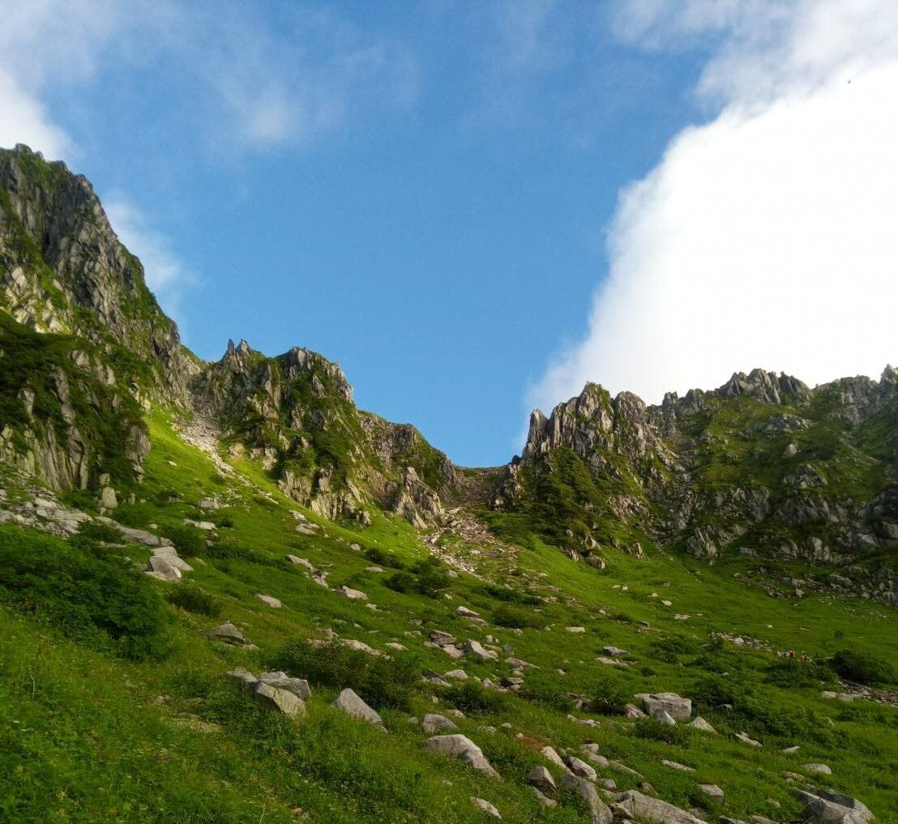
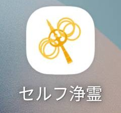
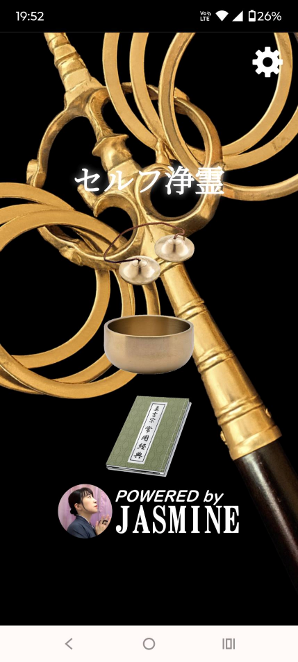
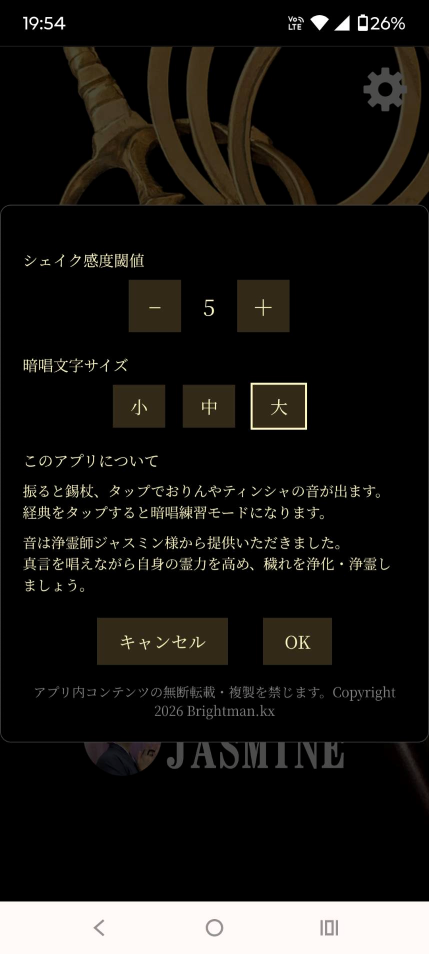
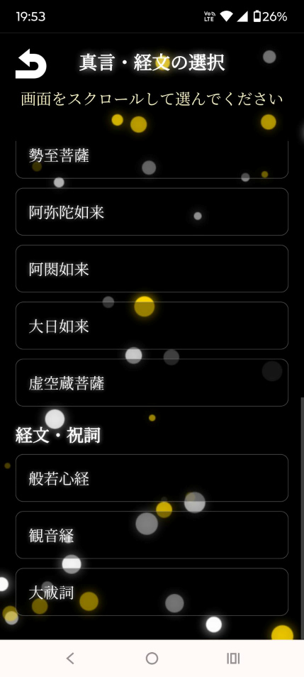
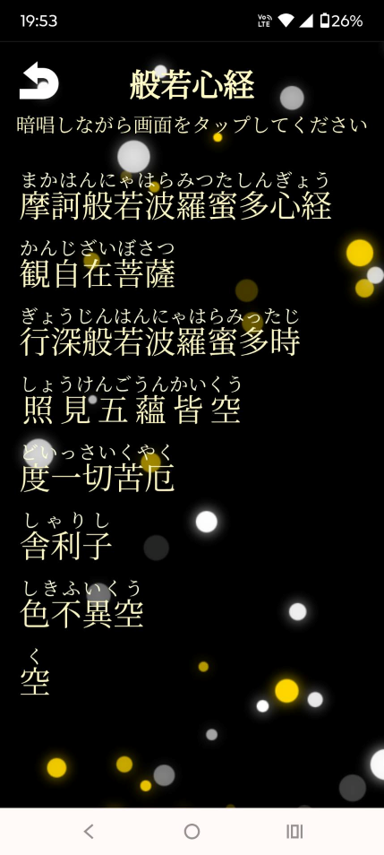

<!-- 背景画像（横幅いっぱい） -->

# My Links

静かに、必要なものだけを置いていく場所。

---

# 🌿 自己紹介

  

様々な気付きを得た50代です。師はジャスミン様です。
日々の学びや実践を、静かに記録していきます。

---

# 📱 自作スマホアプリ紹介

本業は電子回路設計ですが、ITと形而上学の勉強がてら作成したアプリを紹介します。  
以下のアプリを公開しています。

---

## 📲 Webアプリ（PWA）のインストール方法

スマホのホーム画面に追加すると、アプリのように素早く開けます。  
以下の手順で簡単にインストールできます。

📱 **Android（Chrome）**  
- 右上の「︙」をタップ  
- ［ホーム画面に追加］ を選ぶ  
- ［追加］ を押すとホーム画面に入ります

🍎 **iPhone（Safari）**  
- 下の 共有ボタン（□↑） をタップ  
- 下にスクロールして ［ホーム画面に追加］  
- ［追加］ を押すとホーム画面に入ります

---

## 🕯️ セルフ浄霊アプリ

  

浄化・浄霊の修行者向けに作成したWebアプリです。  
振ると錫杖、タップでおりんやティンシャの音が鳴ります。  
経典をタップすると、経文の一部が隠れて記憶を促す暗唱モードになります。
  
音は浄霊師ジャスミン様より提供いただきました。  
真言を唱えて自身の霊力を高め、穢れを浄化して心身を整えていきましょう。

  <a href="https://brightmankx.github.io/self-jyourei/index.html">
    ▶ セルフ浄霊を開く
  </a>

### 🖼️ セルフ浄霊スクリーンショット

<table align="center">
  <tr>
    <td align="center"></td>
    <td align="center"></td>
  </tr>
  <tr>
    <td align="center"></td>
    <td align="center"></td>
  </tr>
</table>

### 📝 セルフ浄霊Q&A

問い合わせや更新履歴を記します。
不具合や改善点をお寄せください。

## ✨ （第２弾アプリ）

現在構想中です。リクエストをお寄せください。

---

# 📸 Instagram

  

里行と山行の日々を記録しています。  
自然の中での気付きや、静かな時間を共有しています。

---

# 📨 お問い合わせ

ご質問やご感想などありましたら、  
メールまたは Instagram の DM からお気軽にお寄せください。

